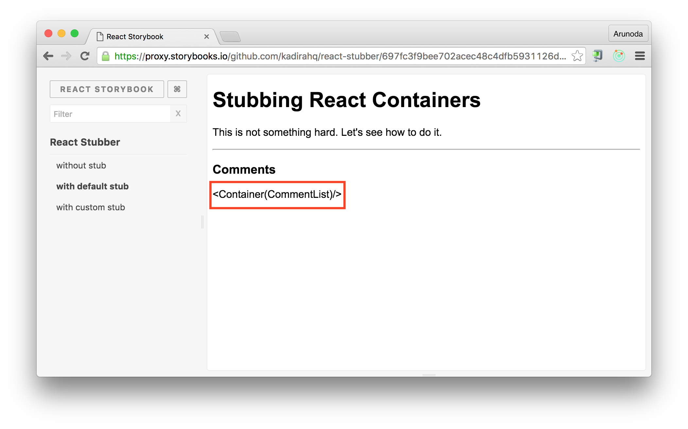
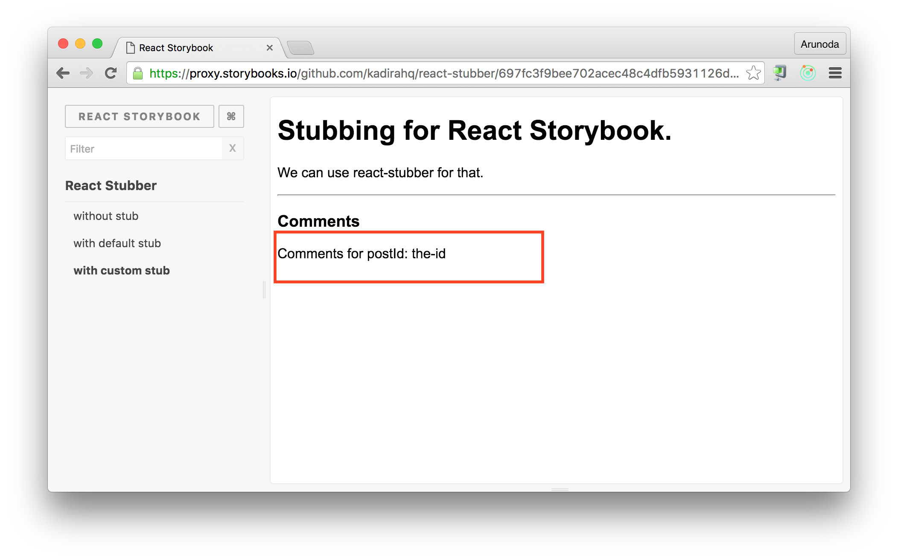

# React Stubber

A simple but useful stubbing solution for React. This will work with any container library whether it's Redux, [React Komposer](https://github.com/kadirahq/react-komposer) or with any React Component.

---

Read this article for an introduction: [Stubbing React Containers for Testing](https://voice.kadira.io/stubbing-react-containers-for-testing-11bcd537e586?source=latest)

## Usage

First of all, we need to wrap React classes we need to stub with the `mayBeStubbed` function. See:

```js
import React from 'react';
// compose if our container building library.
import compose from './compose';
import { mayBeStubbed } from 'react-stubber';

export const CommentList = () => (
  <ul>

  </ul>
);
CommentList.displayName = 'CommentList';
export const CommentListContainer = mayBeStubbed(compose(CommentList));
```

Then we can use the `CommentListContainer` anywhere we need.

So, let's use the above `CommentListContainer` inside another Component called `Post`.

```js
export const Post = (post) => (
  <div style={style}>
    <h1>{post.title}</h1>
    <p>{post.text}</p>
    <hr />
    <h3>Comments</h3>
    <CommentListContainer postId={post.id} />
  </div>
);
```

In order to do isolated testing, first make sure we are in the **stubbing mode**.

We need to do this, before importing any React component. This is something you could do when doing the test setup or in the React Storybook config file.

```js
import { setStubbingMode } from 'react-stubber';
setStubbingMode(true);
```

Then when we render Post we will get something like this:



We can also stub this component with a custom component we like. This is how we do that. You need to do this before using the `Post` component. <br />
(The test file or storybook story file is a good place for this).

```js
import { stub } from 'react-stubber';

stub(CommentListContainer3, (props) => (
  <div>Comments for postId: {props.postId}</div>
));
```

Then once rendered it will looks like this.


